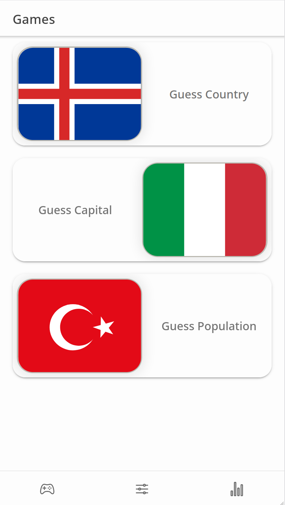
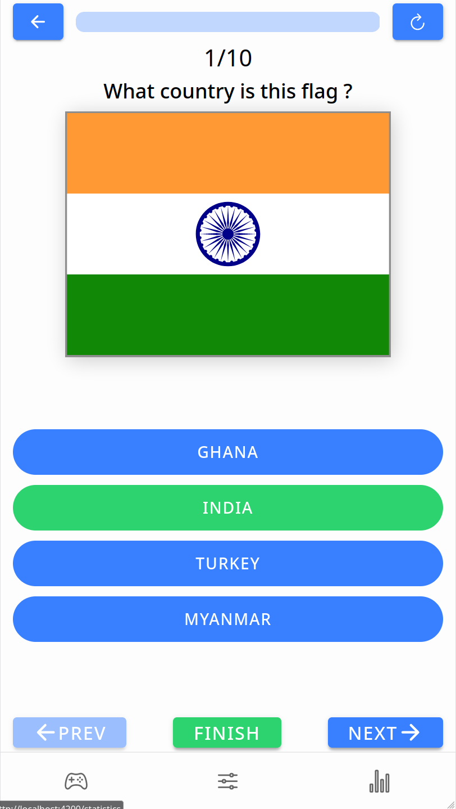
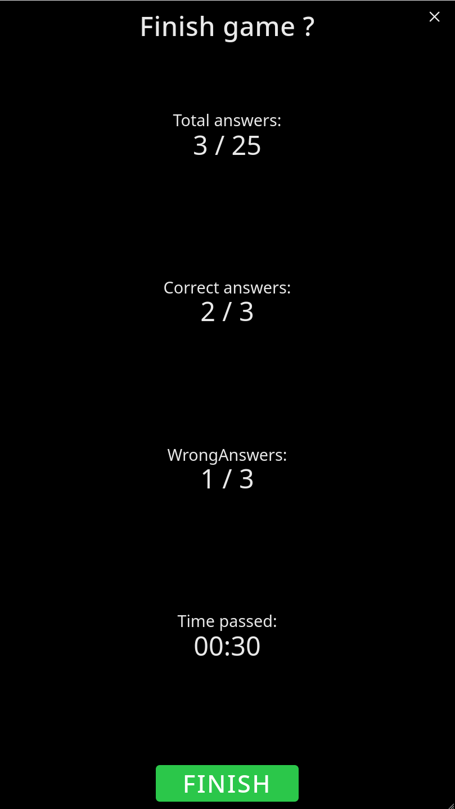

# Geoperion

FOSS geology games build by ionic

## Screenshots

|  |  |  |  
| --- | --- | --- | --- |
|  |  |  |  |  |  |

## Languages

Supported languages are:

* English

* Russian

## Instalation

  **Android:**

* Install from f-droid <https://f-droid.org/en/packages/com.vulnerabbity.geoperion/>

   

* Download apk file from [releases page](https://github.com/vulnerabbity/Geoperion/releases)

  
